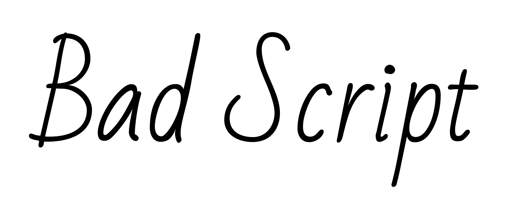
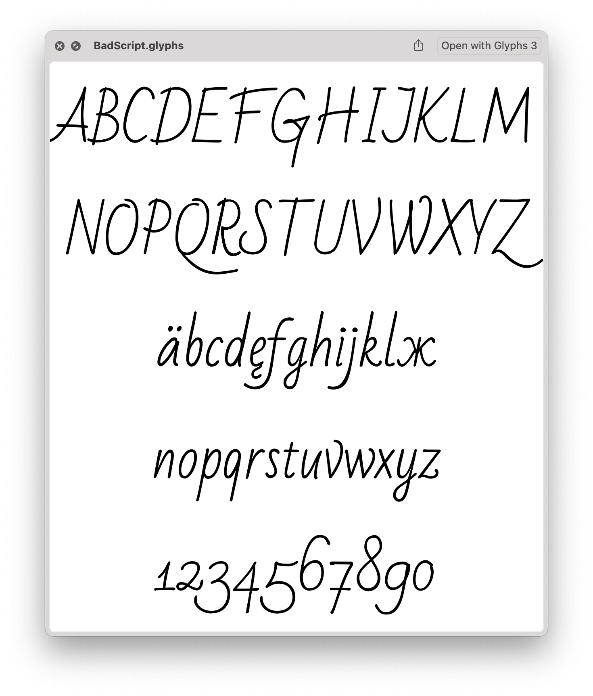

# Bad Script
by Roman Shchyukin

Bad Script started from a simple six-letter logotype and developed into a separate font, supporting Latin and Cyrillic character sets. It was completely made using a tablet to imitate casual and neat handwriting. Designed to resemble the designer's own handwriting, while making it systematic and smooth.

